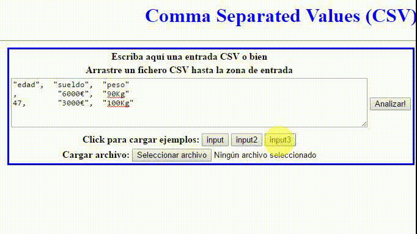

# Práctica 3: Comma separated values (CSV) with mongodb

##Desarrollo de la Práctica

* [Descripción de la práctica](https://campusvirtual.ull.es/1516/mod/page/view.php?id=189370)
* [Repositorio](https://ide.c9.io/alu0100786330/dsi)

# C9 

* [Despliegue](https://dsi-alu0100673647.c9users.io/)

## Enlaces a webs personales

* [Constanza](http://alu0100673647.github.io)
* [Eric](http://alu0100786330.github.io)

